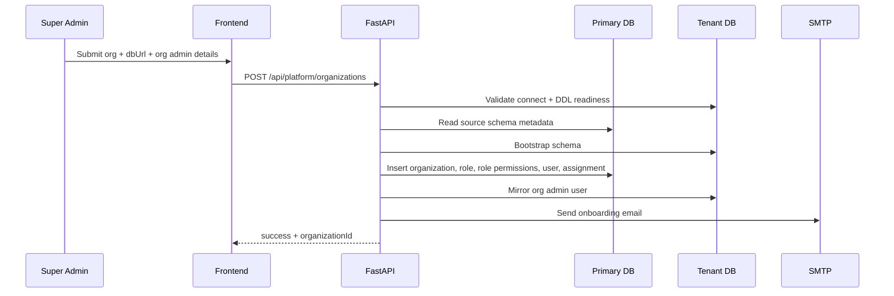

# Multi-Tenant Assessment Platform: Use Cases and Architecture

## 1) System Scope
A single platform deployment serves multiple organizations (institutions/corporates). Each organization has:
- Isolated data via its own `db_url`
- Independent roles and permissions (module-level + action-level)
- Organization users managed by organization admins

Platform super admins manage tenant onboarding, activation/deactivation, and global governance.

## 2) Actors
- Platform Super Admin
- Organization Admin
- Organization User (Faculty/HR/Technical/Placement/etc., role-driven)
- Learner/Employee/Student (test taker)
- System Services (SMTP, DB, Socket Server)

## 3) High-Level Use Case Diagram (Textual)

```mermaid
flowchart TD
    A[Platform Super Admin] --> U1[Create Organization]
    A --> U2[Activate/Deactivate Organization]
    A --> U3[View Organizations]
    A --> U4[Create/Rotate Super Admin Credentials via Env]

    B[Organization Admin] --> U5[Create Role]
    B --> U6[Assign Permissions to Role]
    B --> U7[Create User]
    B --> U8[Assign Role to User]
    B --> U9[Create Test]
    B --> U10[Assign Test to Specific User]
    B --> U11[View Org Users/Roles]

    C[Org User] --> U12[Access Allowed Modules]
    C --> U13[Create/Assign/Evaluate based on permission]

    D[Learner/Employee/Student] --> U14[Login]
    D --> U15[Attend Assigned Test]
    D --> U16[View Results/Analytics allowed by role]

    E[System] --> U17[Tenant DB Bootstrap]
    E --> U18[Tenant Context Routing]
    E --> U19[Email Notifications]
    E --> U20[Audit Logging]
```

## 4) Core Architecture

### 4.1 Components
- Frontend (React):
  - Login and portal routing
  - Dynamic left-menu/dashboard visibility by permissions
  - Sends `x-user-id` and `x-org-id` headers

- API Layer (FastAPI):
  - Auth routes
  - RBAC routes (`organizations`, `roles`, `role_permissions`, `user_role_assignments`)
  - Test/assignment modules
  - Middleware for tenant resolution and org status enforcement

- Data Layer:
  - Primary DB (platform metadata + global users + RBAC)
  - Tenant DB per organization (tenant operational data + mirrored users)

- Infra Services:
  - SMTP (shared across tenants)
  - Socket service (real-time/proctoring/events)
  - Audit pipeline

### 4.2 Data Isolation Model
- Platform tables in primary DB:
  - `organizations`
  - `roles`
  - `role_permissions`
  - `user_role_assignments`
  - global `users` (with `organization_id`)
- Tenant operations use tenant DB selected by organization context.
- Request middleware switches DB pool per request to the tenant DB.

### 4.3 Authorization Model
- Role-based permissions with action granularity, examples:
  - `users.create`, `users.view`
  - `roles.create`, `roles.view`
  - `tests.create`, `tests.assign`, `tests.view`
  - `analytics.view`, `analytics.export`
- UI and API both enforce permissions:
  - UI hides/disables modules
  - API performs authoritative checks

## 5) End-to-End Use Cases

### UC-01: Platform Super Admin creates organization with own DB URL
Actor: Platform Super Admin
Preconditions:
- Super admin authenticated
- Tenant DB URL available
Main flow:
1. Super admin submits org name/code/type + `dbUrl` + org admin credentials.
2. API validates DB URL format and blocks system schemas (`sys`, `mysql`, etc.).
3. API validates connectivity and DDL privileges on tenant DB.
4. API bootstraps schema into tenant DB (clone/create required tables).
5. API creates org record in primary DB.
6. API creates default "Organization Admin" role with broad permissions.
7. API creates org admin user and role assignment.
8. API mirrors org admin into tenant `users` table.
9. API sends email with onboarding credentials.
Postconditions:
- Organization active and usable
- Tenant DB ready
- Org admin can login and manage org
Failure paths:
- Invalid DB URL -> 400
- No CREATE privilege -> 400 with actionable message
- Duplicate org code/email -> 409
- Bootstrap incomplete -> 400

### UC-02: Super Admin activates/deactivates organization
Actor: Platform Super Admin
Main flow:
1. Super admin toggles organization status.
2. API updates `organizations.is_active`.
3. Inactive org users are blocked at auth/tenant middleware.
Postconditions:
- If inactive, users receive: "Organization is inactive. Contact the super admin."

### UC-03: Organization Admin creates custom role
Actor: Organization Admin (or Super Admin)
Main flow:
1. Open RBAC manager.
2. Enter role name/description.
3. Tick permissions (module + action level).
4. Save role.
Postconditions:
- New role available for user assignment.

### UC-04: Organization Admin creates user and assigns role
Actor: Organization Admin
Main flow:
1. Admin searches/provides user details.
2. Select role.
3. Create user.
4. API creates user in primary DB and assigns role.
5. API mirrors user to tenant DB `users`.
6. API sends account email.
Postconditions:
- User can login with permission-scoped experience.

### UC-05: Permission-driven portal/menu visibility
Actor: Any authenticated org user
Main flow:
1. User logs in.
2. Auth response includes role + permissions.
3. Frontend renders only permitted modules/actions.
4. API still validates every protected action.
Postconditions:
- Least-privilege UX + backend security.

### UC-06: Role-based test lifecycle
Actors: Org Admin / Org Users with test permissions
Main flow:
1. Authorized user creates test (`tests.create`).
2. Authorized user assigns to specific user (`tests.assign`).
3. Notification email sent.
4. Candidate attends test.
5. Evaluators view and export analytics if permitted.
Postconditions:
- Full controlled lifecycle by role permissions.

### UC-07: Login blocked for inactive organization
Actor: Any org user in inactive org
Main flow:
1. User attempts login.
2. API checks org status.
3. Login denied with support message.
Postconditions:
- Tenant access protection enforced globally.

## 6) Operational and Admin Use Cases
- Seed default super admins from env-secured passwords.
- Rotate super-admin passwords on startup (env-driven option).
- Shared SMTP used for all tenant notifications.
- Audit logging for API/security events.
- Tenant DB pool caching and request-scoped switching.

## 7) Sequence Diagram: Organization Creation

## 8) Security and Compliance Considerations
- Enforce API-level authorization regardless of frontend visibility.
- Never use system schemas (`sys/mysql/...`) for app data.
- Keep DB credentials and seeded passwords in environment variables only.
- Force password change for newly created users.
- Audit authentication, role changes, user creation, and assignments.
- Deactivation acts as an emergency tenant kill-switch.

## 9) Failure/Edge Cases Matrix
- Tenant DB unreachable: block organization creation.
- Tenant DB no DDL privilege: block with explicit error.
- Duplicate org code: reject.
- Duplicate email: reject.
- Missing tenant DB URL for org user provisioning: reject.
- Inactive organization: block login and tenant access.
- Permission missing: return 403.

## 10) Deployment Model
- Single backend/frontend deployment.
- One primary DB for platform control-plane.
- One DB per organization for data-plane isolation.
- Shared SMTP and socket infra.

## 11) Future Enhancements (Optional)
- Per-tenant SMTP override with fallback to global SMTP.
- Per-tenant branding and custom domains.
- Automated tenant DB migrations with version table.
- Soft-delete and lifecycle policies for tenant offboarding.
